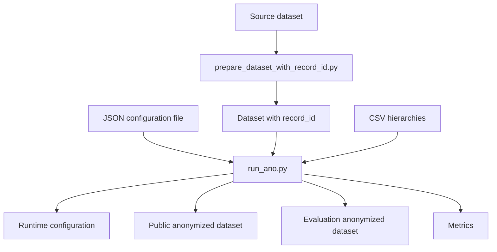

# Anonymization

## Role of this step

Anonymization is the first central step of the project.

Its role is to transform a source dataset into a more protective published version, while keeping enough utility for the downstream steps.

In this project, anonymization is the starting point of the two studied attacks:

- the linkage attack;
- the membership inference attack (MIA).

---

## Main scripts

The most important scripts at this step are:

- `scripts/prepare_dataset_with_record_id.py`
- `scripts/run_ano.py`

### `prepare_dataset_with_record_id.py`
This script prepares a dataset containing a stable internal identifier, usually `record_id`.

It can also produce an updated copy of a base configuration so that it points to the prepared dataset.

### `run_ano.py`
This is the main entry point for anonymization.

It loads a configuration, runs the anonymization through the project's manager, then saves the output files.

---

## General idea

Anonymization roughly follows this logic:

1. start from a source dataset;
2. optionally add `record_id`;
3. load a JSON configuration;
4. build a complete runtime configuration;
5. run the anonymization;
6. produce several useful outputs:
   - the configuration that was actually executed;
   - the public anonymized dataset;
   - the evaluation anonymized dataset;
   - the metrics.

---

## Inputs of the anonymization

### 1. The source dataset

The starting point is a tabular dataset, for example:

- `data/adult.csv`
- `data/adult_with_record_id.csv`

In current project practice, it is preferable to work with a version that already has `record_id`.

### 2. The configuration file

Anonymization is driven by a JSON file describing the experiment.

This file notably contains:

- the path to the dataset;
- the quasi-identifiers;
- the sensitive attribute;
- the insensitive attributes;
- the generalization hierarchies;
- parameters such as `k`, `l`, `t`;
- the suppression limit.

### 3. The generalization hierarchies

Some columns come with CSV hierarchies, for example:

- `hierarchies/age.csv`
- `hierarchies/sex.csv`
- `hierarchies/race.csv`
- `hierarchies/native-country.csv`

Each row of a hierarchy describes a source value and its successive generalization levels.

---

## Types of attributes used

### Quasi-identifiers

Quasi-identifiers are attributes that can facilitate re-identification when cross-referenced.

Common examples in the project:

- `age`
- `sex`
- `race`
- `marital-status`
- `native-country`

These are the columns that are mostly generalized or suppressed.

### Sensitive attribute

The sensitive attribute is the one we especially want to protect.

In the Adult dataset, it is typically:

- `income`

### Insensitive attributes

Insensitive attributes are not used by the anonymization itself.

In the project, `record_id` is typically placed in this category to remain available in the evaluation export. The attack pipeline relies on this: `record_id` must be protected from anonymization at the runtime-config level (added to `insensitive_attributes`, removed from quasi-identifiers and sensitive attributes), otherwise downstream ID matching breaks entirely.

---

## Anonymization parameters

The configuration can include several classic parameters.

### `k`-anonymity

The `k` parameter requires that a record cannot be distinguished from fewer than `k - 1` others on the quasi-identifiers.

### `l`-diversity

The `l` parameter requires a minimum diversity of the sensitive attribute inside the equivalence classes.

### `t`-closeness

The `t` parameter requires that the distribution of the sensitive attribute in each class stays close to the global distribution.

### Suppression limit

A suppression limit can be set to allow removing part of the data when generalization alone is not enough.

---

## Logical flow of `run_ano.py`

### 1. Reading the configuration

The script first loads the requested JSON configuration.

### 2. Building the runtime configuration

The script then produces a complete, usable runtime configuration.

This step is used to:

- resolve paths;
- freeze exactly the parameters that are used;
- save a reproducible trace in `outputs/configs/`.

### 3. Running the anonymization

The script then calls the project's anonymization manager.

This step applies the rules defined in the configuration:

- loading the dataset;
- loading the hierarchies;
- applying the constraints;
- producing the anonymized result.

### 4. File exports

Once anonymization is done, the script can produce:

- a public export;
- an evaluation export;
- a metrics file.

---

## Important note: removal of fully suppressed rows

In the current state of the project, `run_ano.py` removes by default from CSV exports the rows where **all quasi-identifiers are `*`**.

In other words, a row that is fully suppressed at the QI level is usually not kept in:

- `outputs/anonymized/...`
- `outputs/anonymized_eval/...`

This rule explains why:

- `anonymized_eval` can contain fewer rows than the raw anonymizer output;
- some initially-published targets end up not surviving in the export;
- the MIA must reconstruct its IN targets after anonymization.

### Associated option
This automatic removal can be disabled with:

- `--keep-fully-suppressed-records`

---

## Important note: difference between public and evaluation exports

### Public export
The public export represents what the attacker is supposed to see.

Some internal columns can be dropped with:

- `--public-drop-columns`

Typical example:

- `--public-drop-columns record_id`

### Evaluation export
The evaluation export keeps the columns that are useful for internal checks, notably `record_id`.

It must **not** be considered a published file.

---

## Outputs produced

### 1. Executed configuration

Typical folder:

- `outputs/configs/`

The JSON file saved here corresponds to the configuration actually used during the run.

### 2. Public anonymized dataset

Typical folder:

- `outputs/anonymized/`

This is the version meant to represent the published data.

### 3. Evaluation anonymized dataset

Typical folder:

- `outputs/anonymized_eval/`

This version is reserved for internal evaluation.

### 4. Metrics

Typical folder:

- `outputs/metrics/`

These files summarize the anonymization results and also contain useful information about the exports, for example:

- the generated paths;
- the columns dropped from the public version;
- the number of rows removed because all QIs were `*`.

### 5. Benchmark summary

Typical file:

- `outputs/benchmark_summary.csv`

This file aggregates the anonymization runs executed through the current pipeline.

---

## Simplified schema

---

## Summary

Anonymization is not only about generalizing values.

In the current project, it also includes:

- managing a stable internal identifier;
- strict separation between public and evaluation exports;
- default exclusion of fully suppressed rows;
- protection of `record_id` from anonymization via the runtime config;
- production of artifacts reused by the attacks and reports.
