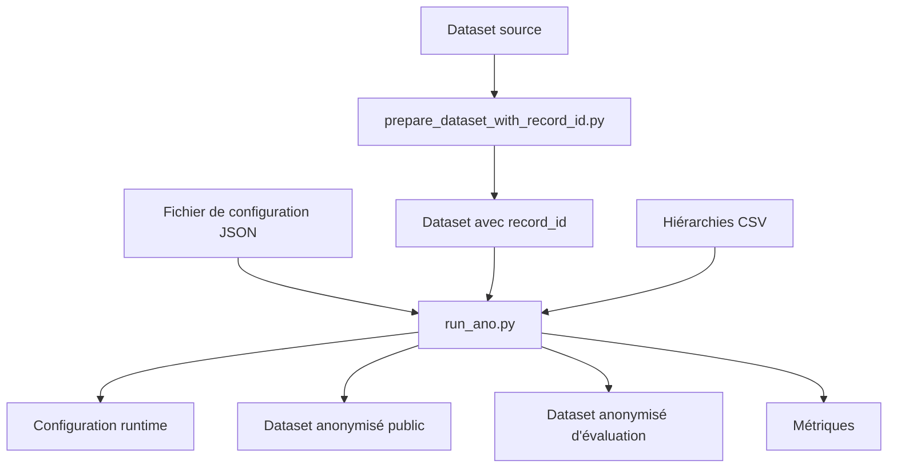

# Anonymisation

## Rôle de cette étape

L'anonymisation est la première étape centrale du projet.

Son rôle est de transformer un dataset source en une version publiée plus protectrice, tout en conservant un niveau d'utilité suffisant pour les étapes suivantes.

Dans ce projet, l'anonymisation sert de point de départ aux deux attaques étudiées ensuite :

- la linkage attack ;
- la membership inference attack (MIA).

---

## Scripts principaux

Les scripts les plus importants pour cette étape sont :

- `scripts/prepare_dataset_with_record_id.py`
- `scripts/run_ano.py`

### `prepare_dataset_with_record_id.py`
Ce script prépare un dataset contenant un identifiant interne stable, généralement `record_id`.

Il peut aussi produire une copie mise à jour d'une configuration de base pour pointer vers ce dataset préparé.

### `run_ano.py`
C'est le point d'entrée principal de l'anonymisation.

Il charge une configuration, exécute l'anonymisation via le gestionnaire du projet, puis sauvegarde les fichiers de sortie.

---

## Idée générale

L'anonymisation suit globalement la logique suivante :

1. partir d'un dataset source ;
2. éventuellement lui ajouter `record_id` ;
3. charger une configuration JSON ;
4. construire une configuration runtime complète ;
5. lancer l'anonymisation ;
6. produire plusieurs sorties utiles :
   - la configuration réellement exécutée ;
   - le dataset anonymisé public ;
   - le dataset anonymisé d'évaluation ;
   - les métriques.

---

## Entrées de l'anonymisation

### 1. Le dataset source

Le point de départ est un dataset tabulaire, par exemple :

- `data/adult.csv`
- `data/adult_with_record_id.csv`

Dans la pratique actuelle du projet, il est préférable de travailler avec une version déjà préparée avec `record_id`.

### 2. Le fichier de configuration

L'anonymisation est pilotée par un fichier JSON décrivant l'expérience.

Ce fichier contient notamment :

- le chemin vers le dataset ;
- les quasi-identifiants ;
- l'attribut sensible ;
- les attributs insensibles ;
- les hiérarchies de généralisation ;
- les paramètres comme `k`, `l`, `t` ;
- la limite de suppression.

### 3. Les hiérarchies de généralisation

Certaines colonnes disposent de hiérarchies CSV, par exemple :

- `hierarchies/age.csv`
- `hierarchies/sex.csv`
- `hierarchies/race.csv`
- `hierarchies/native-country.csv`

Chaque ligne d'une hiérarchie décrit une valeur source et ses niveaux successifs de généralisation.

---

## Types d'attributs utilisés

### Quasi-identifiants

Les quasi-identifiants sont les attributs susceptibles de faciliter une ré-identification lorsqu'ils sont recoupés.

Exemples fréquents dans le projet :

- `age`
- `sex`
- `race`
- `marital-status`
- `native-country`

Ce sont principalement ces colonnes qui sont généralisées ou supprimées.

### Attribut sensible

L'attribut sensible est celui que l'on veut particulièrement protéger.

Dans le dataset Adult, il s'agit souvent de :

- `income`

### Attributs insensibles

Les attributs insensibles ne servent pas à l'anonymisation elle-même.

Dans le projet, `record_id` est typiquement placé dans cette catégorie pour rester disponible dans l'export d'évaluation.

---

## Paramètres d'anonymisation

La configuration peut inclure plusieurs paramètres classiques.

### `k`-anonymity

Le paramètre `k` impose qu'un enregistrement ne puisse pas être distingué de moins de `k - 1` autres sur les quasi-identifiants.

### `l`-diversity

Le paramètre `l` impose une diversité minimale de l'attribut sensible dans les classes d'équivalence.

### `t`-closeness

Le paramètre `t` impose que la distribution de l'attribut sensible dans chaque classe reste proche de la distribution globale.

### Limite de suppression

Une limite de suppression peut être fixée pour autoriser la suppression d'une partie des données lorsque la généralisation seule ne suffit pas.

---

## Déroulement logique de `run_ano.py`

### 1. Lecture de la configuration

Le script charge d'abord le JSON de configuration demandé.

### 2. Construction de la configuration runtime

Le script produit ensuite une configuration runtime complète et exploitable.

Cette étape sert notamment à :

- résoudre les chemins ;
- figer exactement les paramètres utilisés ;
- sauvegarder une trace reproductible dans `outputs/configs/`.

### 3. Lancement de l'anonymisation

Le script appelle ensuite le gestionnaire d'anonymisation du projet.

Cette étape applique les règles définies dans la configuration :

- chargement du dataset ;
- chargement des hiérarchies ;
- application des contraintes ;
- production du résultat anonymisé.

### 4. Export des fichiers

Une fois l'anonymisation terminée, le script peut produire :

- un export public ;
- un export d'évaluation ;
- un fichier de métriques.

---

## Point important : suppression des lignes totalement supprimées

Dans l'état actuel du projet, `run_ano.py` retire par défaut des exports CSV les lignes dont **tous les quasi-identifiants valent `*`**.

Autrement dit, une ligne complètement supprimée au niveau des QI n'est généralement pas gardée dans :

- `outputs/anonymized/...`
- `outputs/anonymized_eval/...`

Cette règle explique pourquoi :

- `anonymized_eval` peut contenir moins de lignes que le résultat brut de l'anonymiseur ;
- certaines cibles publiées au départ ne survivent finalement pas dans l'export ;
- la MIA doit reconstruire ses cibles IN après anonymisation.

### Option associée
Cette suppression automatique peut être désactivée avec :

- `--keep-fully-suppressed-records`

---

## Point important : différence entre export public et export d'évaluation

### Export public
L'export public représente ce que l'attaquant est censé voir.

On peut y retirer certaines colonnes internes avec :

- `--public-drop-columns`

Exemple typique :

- `--public-drop-columns record_id`

### Export d'évaluation
L'export d'évaluation conserve les colonnes utiles à la vérification interne, notamment `record_id`.

Il ne doit pas être considéré comme un fichier publié.

---

## Sorties produites

### 1. Configuration exécutée

Dossier typique :

- `outputs/configs/`

Le fichier JSON sauvegardé ici correspond à la configuration réellement utilisée pendant l'exécution.

### 2. Dataset anonymisé public

Dossier typique :

- `outputs/anonymized/`

C'est la version censée représenter les données publiées.

### 3. Dataset anonymisé d'évaluation

Dossier typique :

- `outputs/anonymized_eval/`

Cette version est réservée à l'évaluation interne.

### 4. Métriques

Dossier typique :

- `outputs/metrics/`

Ces fichiers résument les résultats de l'anonymisation et incluent aussi des informations utiles sur les exports, par exemple :

- les chemins générés ;
- les colonnes retirées du public ;
- le nombre de lignes supprimées parce que tous les QI étaient `*`.

### 5. Résumé benchmark

Fichier typique :

- `outputs/benchmark_summary.csv`

Ce fichier agrège les runs d'anonymisation exécutés via le pipeline courant.

---

## Schéma simplifié

---

## Résumé

L'anonymisation ne consiste pas seulement à généraliser des valeurs.

Dans le projet actuel, elle inclut aussi :

- la gestion d'un identifiant interne stable ;
- la distinction stricte entre public et évaluation ;
- l'exclusion par défaut des lignes totalement supprimées ;
- la production d'artefacts réutilisables par les attaques et les rapports.
