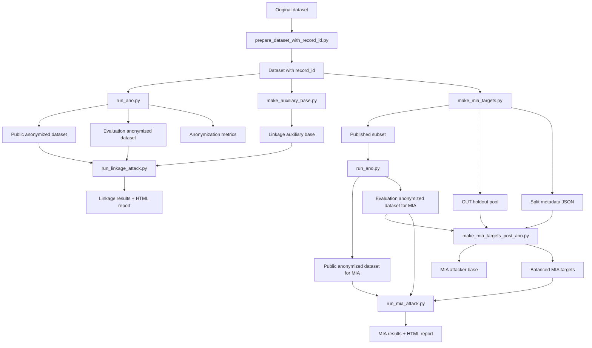

# Project overview

## Project goal

This project studies the effect of dataset anonymization on privacy protection.

The goal is to observe what an attacker can still do once data is published, focusing on three main parts:

- anonymization;
- the **linkage attack**;
- the **membership inference attack (MIA)**.

The general idea is simple: start from a source dataset, apply an anonymization, then measure what an attacker can still infer from the published data.

---

## The main building blocks of the pipeline

The project pipeline relies on several complementary steps:

1. prepare a dataset with a stable internal identifier `record_id`;
2. run an anonymization;
3. produce:
   - a public anonymized dataset;
   - an evaluation anonymized dataset;
   - anonymization metrics;
4. prepare the inputs of the linkage attack;
5. prepare the inputs of the MIA;
6. run the attacks;
7. save the detailed results and HTML reports.

---

## Difference between public dataset and evaluation dataset

The project handles two main views of the anonymized dataset.

### Public anonymized dataset
This is the version meant to represent what would actually be published.

It may drop internal columns such as `record_id`.

### Evaluation anonymized dataset
This is an internal version reserved for evaluation.

It notably keeps `record_id`, which allows:

- knowing whether a target's true record has survived;
- measuring the real quality of the attacks;
- keeping a clean link between the different steps.

This version must **not** be considered visible to the attacker.

---

## Pipeline overview

---

## Anonymization branch

Anonymization is the foundation of the project.

It transforms a source dataset into several outputs:

- a runtime configuration in `outputs/configs/`;
- a public anonymized dataset in `outputs/anonymized/`;
- an evaluation anonymized dataset in `outputs/anonymized_eval/`;
- metrics in `outputs/metrics/`.

By default, rows whose quasi-identifiers are all `*` are removed from the CSV exports.

---

## Linkage attack branch

The linkage attack uses:

- an auxiliary base containing the attributes known to the attacker;
- the public anonymized dataset;
- the evaluation anonymized dataset.

In the current state of the project, it follows an **equivalence class logic in two phases**, driven by the attacker-observed `visible_level` of each known attribute:

1. **equivalence class phase 1**: build an initial equivalence class using attacker-known attributes that appear **generalized or suppressed** in the release (`visible_level != 0`);
2. **equivalence class phase 2**: reduce that class using attacker-known attributes that remain **in clear text** in the release (`visible_level == 0`), either by exact match or with `privJedAI` fuzzy matching.

An optional **schema-matching step** may be inserted between the two phases: when some clear-text columns of the release have obfuscated names, Valentine-based matchers (`coma`, `jaccard`, `distribution`) or a pure-Python `baseline_jaccard` try to recover the original column names before phase 2 runs.

The main output is not only the search for a unique candidate, but also the inference of the sensitive attribute from the final class.

---

## MIA branch

The MIA now follows a two-step logic.

### Step 1: pre-anonymization split
`make_mia_targets.py` no longer builds the final targets directly.

It mainly produces:

- a `published subset` which will be anonymized;
- an `OUT holdout pool` which will stay out of the published dataset;
- a JSON file with the split metadata.

### Step 2: post-anonymization construction
`make_mia_targets_post_ano.py` then builds:

- a balanced attacker base;
- the real IN and OUT targets;
- the `is_member` labels.

IN targets are picked **only** from records that actually survived in `anonymized_eval`.

The MIA itself also uses the phase 1 / phase 2 equivalence class logic, with the same split rule based on `visible_level`.

---

## What the pipeline can measure

The full pipeline lets us observe several things:

- the level of generalization and suppression produced by anonymization;
- the difficulty of linking a target to anonymized rows;
- the ability to infer a sensitive attribute after filtering;
- the ability to predict membership of a target in the published dataset;
- the contribution of schema matching: how much of the phase-2 refinement power survives when column names in the release are not known to the attacker.

The project is therefore not limited to producing anonymized datasets: it also seeks to measure concretely what an attacker can still learn.
