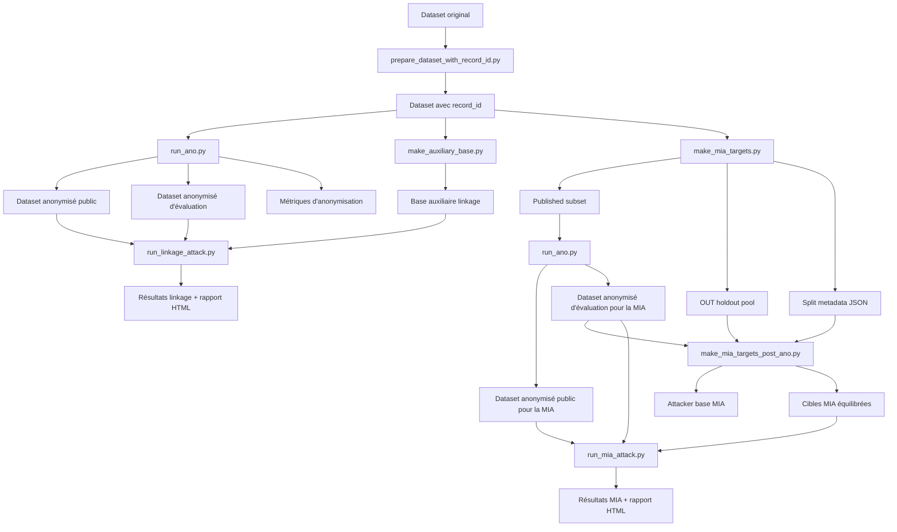

# Vue générale du projet

## Objectif du projet

Ce projet étudie l'effet de l'anonymisation d'un dataset sur la protection de la vie privée.

Le but est d'observer ce qu'un attaquant peut encore faire après publication des données, en se concentrant sur trois parties principales :

- l'anonymisation ;
- la **linkage attack** ;
- la **membership inference attack (MIA)**.

L'idée générale est simple : on part d'un dataset source, on applique une anonymisation, puis on mesure ce qu'un attaquant peut encore inférer à partir des données publiées.

---

## Les grandes briques du pipeline

Le pipeline du projet repose sur plusieurs étapes complémentaires :

1. préparer un dataset avec un identifiant interne stable `record_id` ;
2. lancer une anonymisation ;
3. produire :
   - un dataset anonymisé public ;
   - un dataset anonymisé d'évaluation ;
   - des métriques d'anonymisation ;
4. préparer les entrées de la linkage attack ;
5. préparer les entrées de la MIA ;
6. exécuter les attaques ;
7. sauvegarder les résultats détaillés et les rapports HTML.

---

## Différence entre dataset public et dataset d'évaluation

Le projet manipule deux vues principales du dataset anonymisé :

### Dataset anonymisé public
C'est la version censée représenter ce qui serait réellement publié.

Elle peut exclure des colonnes internes comme `record_id`.

### Dataset anonymisé d'évaluation
C'est une version interne, réservée à l'évaluation.

Elle conserve notamment `record_id`, ce qui permet :

- de savoir si le vrai record d'une cible a survécu ;
- de mesurer la qualité réelle des attaques ;
- de garder un lien propre entre les étapes.

Cette version ne doit pas être considérée comme visible par l'attaquant.

---

## Vue d'ensemble du pipeline

---

## Branche anonymisation

L'anonymisation est le socle du projet.

Elle transforme un dataset source en plusieurs sorties :

- une configuration runtime dans `outputs/configs/` ;
- un dataset anonymisé public dans `outputs/anonymized/` ;
- un dataset anonymisé d'évaluation dans `outputs/anonymized_eval/` ;
- des métriques dans `outputs/metrics/`.

Par défaut, les lignes dont tous les quasi-identifiants valent `*` sont retirées des exports CSV.

---

## Branche linkage attack

La linkage attack utilise :

- une base auxiliaire contenant les attributs connus par l'attaquant ;
- le dataset anonymisé public ;
- le dataset anonymisé d'évaluation.

Dans l'état actuel du projet, elle suit une logique en deux étages :

1. construire une classe d'équivalence avec les attributs vus comme généralisés ou supprimés ;
2. essayer de réduire cette classe avec les attributs restés en clair.

Le résultat principal n'est pas seulement la recherche d'un candidat unique, mais aussi l'inférence de l'attribut sensible à partir de la classe finale.

---

## Branche MIA

La MIA suit désormais une logique en deux temps.

### Étape 1 : split pré-anonymisation
`make_mia_targets.py` ne construit plus directement les cibles finales.

Il produit surtout :

- un `published subset` qui sera anonymisé ;
- un `OUT holdout pool` qui restera hors du dataset publié ;
- un fichier JSON de métadonnées de split.

### Étape 2 : construction post-anonymisation
`make_mia_targets_post_ano.py` reconstruit ensuite :

- une attacker base équilibrée ;
- les vraies cibles IN et OUT ;
- les labels `is_member`.

Les cibles IN sont choisies uniquement parmi les enregistrements qui ont réellement survécu dans `anonymized_eval`.

---

## Ce que le pipeline permet de mesurer

Le pipeline complet permet d'observer plusieurs choses :

- le niveau de généralisation et de suppression produit par l'anonymisation ;
- la difficulté de relier une cible à des lignes anonymisées ;
- la capacité d'inférer un attribut sensible après filtrage ;
- la capacité de prédire l'appartenance d'une cible au dataset publié.

Le projet ne se limite donc pas à produire des datasets anonymisés : il cherche aussi à mesurer concrètement ce qu'un attaquant peut encore apprendre.
